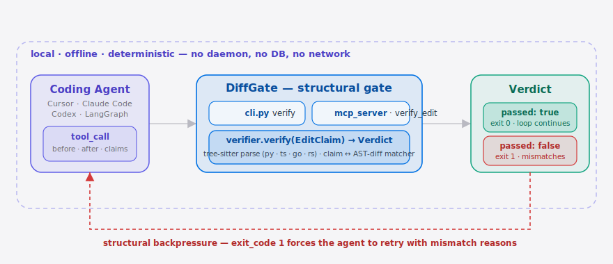

[简体中文](./README.md) | **English**

<p align="center">
  
</p>

<p align="center">
  <a href="LICENSE"></a>
  
  
  
  
  
  
</p>

> **DiffGate is the structural verification gate that catches lying coding agents before the loop returns success.**

## Table of contents

- [Why this exists](#why-this-exists)
- [Architecture](#architecture)
- [Quickstart](#quickstart)
- [Demo](#demo)
- [How it works](#how-it-works)
- [vs the closest neighbors](#vs-the-closest-neighbors)
- [Configuration](#configuration)
- [Roadmap](#roadmap)
- [Pricing](#pricing)
- [License & contributing](#license--contributing)
- [Share this](#share-this)

## Why now

Tool-use loops became the default Coding Agent UX in late 2025 — Cursor composer, Claude Code, Codex CLI, the bundled agent in [langgenius/dify](https://github.com/langgenius/dify), and adapters like [ChromeDevTools/chrome-devtools-mcp](https://github.com/ChromeDevTools/chrome-devtools-mcp). They all share one failure mode: the agent returns `success` on an edit step when the diff is empty, in the wrong region, or only describes the change in a comment. Reuben Brooks' essay *Structural Backpressure Beats Smarter Agents* (HN 144 pts) named the missing piece; Tessl's 1,281-run study quantified it as one of the top failure classes on large codebases. DiffGate is a working implementation of that thesis — an exit-code-1 AST gate that drops into the Agentic loop without retraining anything.

## Why this exists

Coding agents — Cursor, Claude Code, Codex, GPT-5.5 — frequently report `success` on edit steps when the diff is empty, in the wrong file, or only promised in a comment. No mainstream agent framework performs structural verification after the edit. DiffGate sits between the agent's tool call and the next loop iteration: it parses the AST before and after, compares against the agent's own `claimed_actions`, and returns `exit_code=1` on mismatch so the loop retries. A class of silent lies becomes loud, retry-triggering errors.

##  Architecture

<p align="center">
  <picture>
    <source media="(prefers-color-scheme: dark)" srcset="./assets/atlas-dark.svg">
    <source media="(prefers-color-scheme: light)" srcset="./assets/atlas-light.svg">
    
  </picture>
</p>

A coding agent (Cursor / Claude Code / Codex / LangGraph) emits an **`EditClaim`** after every edit — the before-blob, the after-blob, and the actions it claims it performed. `cli.py` and `mcp_server.py` are two thin shells over the same `verifier.verify(EditClaim) → Verdict`: the core parses both sides into an AST with tree-sitter (Python / TypeScript / TSX / JavaScript / Go / Rust / Java / C++ / Ruby) and aligns each claim against the real structural diff. The **Verdict** either passes the loop through (`exit 0`) or returns `exit_code=1` as **structural backpressure**, bouncing the agent back to retry with the mismatch reasons attached — all local, offline and deterministic, with no daemon, no DB and no network calls.

## Quickstart

```bash
pipx install diffgate                                          # ≤30s
diffgate verify --before X.py --after X.py.new --claim "rename foo→bar"
diffgate mcp-server --stdio                                    # register in Claude Code / Cursor mcp.json
```

Drop these three lines into `~/.config/claude-code/mcp.json` (or the Cursor equivalent):

```json
{
  "mcpServers": {
    "diffgate": { "command": "diffgate", "args": ["mcp-server", "--stdio"] }
  }
}
```

Full hook walkthrough: [`examples/claude_code_hook.md`](./examples/claude_code_hook.md). Cursor integration: [`examples/cursor_integration.md`](./examples/cursor_integration.md).

##  Demo

<p align="center">
  
</p>

<sub>↑ Recorded in the terminal (rendered in CI by <a href="https://github.com/charmbracelet/vhs">vhs</a> from <a href="./docs/demo.tape">docs/demo.tape</a>, regenerated on every tag).</sub>

60 seconds: Claude Code claims it renamed `foo` to `bar` across `module_x.py` → DiffGate parses both blobs → AST shows zero renames → `exit_code=1` → agent retries with the failure context.

## How it works

Three local processes, all offline:

```
[ coding agent ]  ──tool_call──►  [ diffgate MCP server (python) ]
                                          │
                                          ▼
                                  [ verifier core ]
                                   ├── tree-sitter parsers (py/ts/tsx/js/go/rs/java/cpp/ruby)
                                   └── claim → ast_change matcher
```

The core data primitive is the **`EditClaim`**:

```python
EditClaim {
  before_blob: str
  after_blob: str
  claimed_actions: [
    {kind: "rename"|"add"|"delete"|"move"|"signature_change",
     symbol: str, scope: str}
  ]
}
→ Verdict { passed: bool, mismatches: [...], structural_diff: ast_summary }
```

`cli.py` and `mcp_server.py` are thin wrappers over the same `verifier.verify(edit_claim) → Verdict`. No daemon, no DB, no network calls.

### Scope-aware matching — v0.2.0

The `scope` field in `claimed_actions` is now strictly enforced. Claiming
`add MyClass.helper` only passes when `helper` really lands inside `MyClass` —
an agent that added a module-level `helper()` instead no longer satisfies it.
This closes a common silent lie: conflating a class method with a same-named
free function.

```bash
# Agent claims it added method helper to class A, but only added a free function → exit_code 1
diffgate verify --before a.py --after a.py.new --claim "add helper in A"
```

An empty `scope` stays a wildcard and matches by symbol name (identical to v0.1
behaviour), so existing unscoped claims are unaffected.

## vs the closest neighbors

Honest comparison — DiffGate is narrow on purpose:

| Axis                                       | DiffGate           | [Aider](https://github.com/Aider-AI/aider) test-loop | [langgenius/dify](https://github.com/langgenius/dify) | [ChromeDevTools/chrome-devtools-mcp](https://github.com/ChromeDevTools/chrome-devtools-mcp) |
| ------------------------------------------ | ------------------ | ---------------------------------------------------- | ----------------------------------------------------- | ------------------------------------------------------------------------------------------- |
| Catches empty-diff / wrong-region "success" | ✓                  | —                                                    | —                                                     | —                                                                                           |
| Behavioral correctness (runs tests)        | —                  | ✓                                                    | partial                                               | —                                                                                           |
| Agentic workflow orchestration             | —                  | partial                                              | **✓ (far beyond DiffGate)**                          | —                                                                                           |
| Browser / DevTools-side observation        | —                  | —                                                    | —                                                     | **✓ (far beyond DiffGate)**                                                                |
| Cross-agent / cross-IDE                    | ✓ (MCP protocol)   | Aider-only                                           | Dify-only                                             | Chrome-only                                                                                 |
| Deployment                                 | single local proc  | single proc                                          | multi-service / containers                            | Chrome extension                                                                            |

DiffGate fixes one class of bug (structural lies). It doesn't replace any of the above. Aider remains the better pair-programmer; Dify the better Agent orchestrator; chrome-devtools-mcp remains the only browser-side observer.

## Configuration

| Key              | Type   | Default            | Meaning                                                     |
| ---------------- | ------ | ------------------ | ----------------------------------------------------------- |
| `languages`      | list   | `[py, ts, tsx, js, go, rs, java, cpp, ruby]` | Enabled tree-sitter parsers                                 |
| `strict_renames` | bool   | `true`             | Rename claim must touch all references; `false` only verifies declaration |
| `mcp.transport`  | enum   | `stdio`            | `stdio` or `sse`                                            |
| `bench.traces`   | path   | bundled 200        | Ground-truth JSONL consumed by `diffgate bench`             |

Full config in `diffgate --help`.

## Roadmap

- [x] **m1 — `diffgate verify`**: CLI + Python/TS parsers + 20 hand-crafted silent-lie fixtures all detected
- [x] **m2 — `diffgate mcp-server`**: MCP `verify_edit` tool, plug-and-play with Claude Code / Cursor
- [x] **m3 — `diffgate bench`**: replay traces, emit precision/recall
- [x] **v0.2 — scope-aware verification**: strict `scope` matching that catches "class method vs same-named free function" confusion
- [x] **v0.3 — CLI/MCP parity + more languages**: structured `--claim-file` (incl. stdin), multi-file verify, new Java / C++ / Ruby parsers, plus three silent-lie fixes
- [ ] **DiffGate Cloud** (paid): cross-team catch-rate aggregation, SSO, Prometheus exporter
- [ ] **framework integrations**: official optional gate in LangGraph / Mastra / Autogen

## Pricing

**Self-hosted is free forever.** CLI, MCP server, tree-sitter parsers, bench harness — all MIT, no phone-home.

**Paid product (v0.2) — DiffGate Cloud.** A hosted aggregation dashboard for internal Dev Platform teams (ByteDance, Alibaba, Tencent, Meituan, JD-class orgs). Aggregates per-engineer / per-team agent catch-rates, ships with SSO, audit log, Prometheus exporter, and prioritized Java / C++ parsers. Indicative price ~**¥1,200 / engineer / year (≈ USD 165)**, volume-tiered — roughly one-third of a Cursor Business seat, positioned as "the safety net for the seat you already pay for." Pilot path: 14-day free trial → day-14 readout (aggregated catch-rate + estimated engineer-hours saved) → annual contract from ¥100k minimum, scaling by seats. Billing via Stripe (USD) + Alipay International / WeChat Merchant (CNY).

If you run platform engineering at a large Chinese tech org, email `leo.stack@outlook.com` for a pilot slot.

## License & contributing

MIT — see [LICENSE](./LICENSE). False positives, missed catches, ergonomics — all welcome as issues; paste an `EditClaim` `before`/`after` and reproduction is cheap. Please open an issue before sending a PR so we can align scope.

## Share this

```
DiffGate — the structural verification gate for your Coding Agent.
Drops into the Agentic loop and turns "I fixed it" lies into exit-code 1.
OSS, MCP-native. https://github.com/SuperMarioYL/diffgate
```

---

<sub>MIT © 2026 SuperMarioYL</sub>
