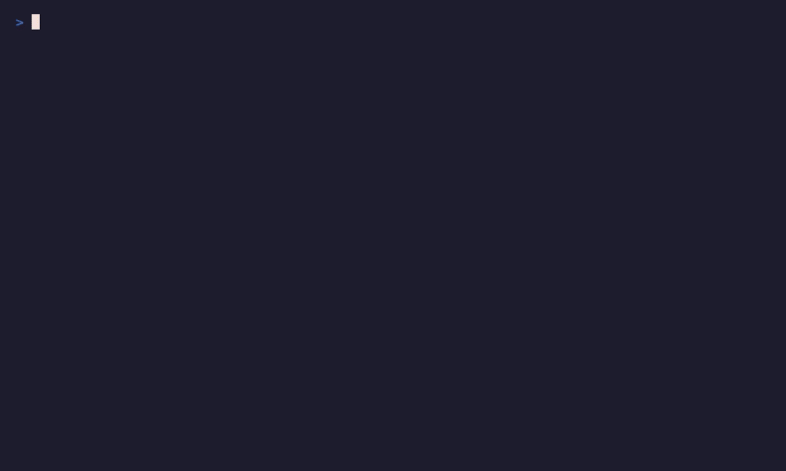

[简体中文](./README.md) · [Website](https://diffgate.lei6393.com) · [GitHub](https://github.com/SuperMarioYL/diffgate)

<picture>
  <source media="(max-width: 600px) and (prefers-color-scheme: dark)" srcset="./assets/presentation/hero-mobile-dark.svg">
  <source media="(max-width: 600px)" srcset="./assets/presentation/hero-mobile-light.svg">
  <source media="(prefers-color-scheme: dark)" srcset="./assets/presentation/hero-dark.svg">
  
</picture>

# diffgate

**Check an edit claim against the code that changed.**

DiffGate parses before and after source blobs, computes structural changes and compares them with explicit edit claims.

## Why use it

A successful tool response can still leave the source unchanged or modify the wrong symbol. An explicit before/after claim lets a harness check that structural work occurred before continuing.

- **Deterministic mismatch** — The verdict comes from source structure.
- **Scope-aware claims** — Claims can target a specific symbol scope.
- **Common core** — CLI and MCP expose the same verifier.

## Architecture

<picture>
  <source media="(max-width: 600px) and (prefers-color-scheme: dark)" srcset="./assets/presentation/architecture-mobile-dark.svg">
  <source media="(max-width: 600px)" srcset="./assets/presentation/architecture-mobile-light.svg">
  <source media="(prefers-color-scheme: dark)" srcset="./assets/presentation/architecture-dark.svg">
  
</picture>

Tree-sitter parsers extract symbols and scopes. The verifier computes added, deleted, signature-changed and body-changed symbols, then matches supported claimed actions. CLI and MCP return the same deterministic verdict and mismatch evidence.

| Component | Responsibility |
| --- | --- |
| `Before / after blobs` | EditClaim input |
| `Tree-sitter symbols` | parsers.py |
| `Claim verifier` | verifier.py |
| `CLI / MCP verdict` | Machine-readable mismatch |

## Install and quickstart

Build with the version declared in the repository manifest. Run the example from the repository root.

```bash
git clone https://github.com/SuperMarioYL/diffgate.git
cd diffgate
uv venv .venv
uv pip install --python .venv/bin/python -e .
source .venv/bin/activate
```

Compare the same explicit foo-to-bar rename claim against unchanged Python source and a real renamed function.

```bash
.venv/bin/python examples/presentation-demo.py
```

## Recorded demo

<picture>
  <source media="(max-width: 600px) and (prefers-color-scheme: dark)" srcset="./assets/presentation/process-mobile-dark.svg">
  <source media="(max-width: 600px)" srcset="./assets/presentation/process-mobile-light.svg">
  <source media="(prefers-color-scheme: dark)" srcset="./assets/presentation/process-dark.svg">
  
</picture>

The unchanged case is rejected and the structurally renamed case is accepted.

```text
{"case": "unchanged", "passed": false, "mismatches": ["claimed rename foo\u2192bar but neither name appears in the structural diff (no-op edit)"]}
{"case": "renamed", "passed": true, "mismatches": []}
```

The complete command and output are recorded in [docs/demo-results.json](./docs/demo-results.json). Inputs and reproduction code are included in the repository.



The existing recording is retained for context; the text example above documents the reproducible scenario.

## Usage

The CLI exposes the following operations. Commands after the example use your own paths or identifiers.

```bash
diffgate verify --before before.py --after after.py --claim "rename foo->bar" --json
diffgate diff --before before.py --after after.py --json
diffgate mcp-server --stdio
```

## Configuration

Select before/after files and a supported claim. --lang can override extension-based detection; --json emits structured data. Programmatic EditClaim accepts source blobs, language and ClaimedAction objects with optional scope and new_symbol.

## Integrations and responsibilities

<picture>
  <source media="(max-width: 600px) and (prefers-color-scheme: dark)" srcset="./assets/presentation/integrations-mobile-dark.svg">
  <source media="(max-width: 600px)" srcset="./assets/presentation/integrations-mobile-light.svg">
  <source media="(prefers-color-scheme: dark)" srcset="./assets/presentation/integrations-dark.svg">
  
</picture>

The following routes are implemented in the source. Choose the input that matches your task and keep the resulting artifact with your project.

| Route | Implemented role |
| --- | --- |
| Source blobs / files | Before and after input |
| Edit claims | Rename, add, delete, move, signature |
| Multiple grammars | Supported tree-sitter languages |
| CLI / MCP | Harness integration surfaces |

## Limits and next steps

- A structural match does not prove semantic correctness, complete reference updates or passing tests.
- Claims cover the supported action vocabulary and parser behavior. Keep normal testing alongside this gate.
- The demo checks only a small Python rename case, not every supported language or cross-file scenario.

Further grammar and scope refinements should follow reproducible mismatches. Structural verification remains complementary to behavioral tests.

## License and contributions

See [LICENSE](./LICENSE). When reporting an issue, include a minimal input, the command, and the observed output.
